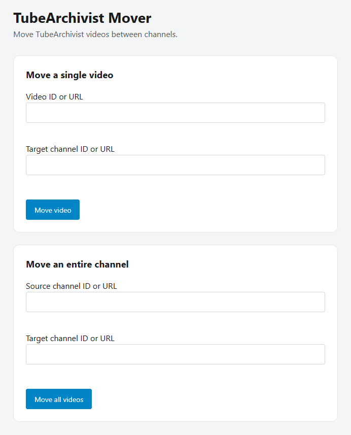

# TubeArchivist Mover

A small application that moves [TubeArchivist](https://www.tubearchivist.com/) videos from one channel to another, updating Elasticsearch index and filesystem.



> **Heads up:** this tool moves files and edits your TubeArchivist index
> directly. Test against a small video first and make sure you have backups.
>
> It is strongly recommended to disable the "Refresh Metadata" schedule in TA.

## What it does

For a given video id and target channel id it:

1. Looks up the video (`ta_video`) and target channel (`ta_channel`) in Elasticsearch.
2. Renames `DATA_DIR/<oldChannelId>/<videoId>.mp4` → `DATA_DIR/<newChannelId>/<videoId>.mp4`.
3. Renames any subtitle `.vtt` files alongside it.
4. Updates the video document in Elasticsearch.
5. If the Elasticsearch update fails, every file rename is rolledback.

## Environment variables

| Variable           | Required | Default     | Description                         |
| ------------------ | -------- | ----------- | ----------------------------------- |
| `PORT`             | no       | `9000`      | HTTP port the server listens on.    |
| `DATA_DIR`         | no       | `/youtube`  | Root of the shared TA media volume. |
| `ES_URL`           | **yes**  | —           | Base URL of Elasticsearch.          |
| `ELASTIC_USER`     | no       | `elastic`   | Elasticsearch username.             |
| `ELASTIC_PASSWORD` | **yes**  | —           | Elasticsearch password.             |

## Running locally

Copy and complete `.env.example` into `.env`.

```sh
bun install
bun start
```

Then open <http://localhost:9000>.

## Running with Docker

Build:

```sh
docker build -t tubearchivist-mover .
```

Run, sharing TubeArchivist's media volume and joining its network so the
container can reach Elasticsearch by service name:

```sh
docker run -d \
  --name tubearchivist-mover \
  --network tubearchivist_default \
  -p 9000:9000 \
  -e ES_URL=http://archivist-es:9200 \
  -e ELASTIC_PASSWORD=verysecret \
  -v tubearchivist_media:/youtube \
  tubearchivist-mover
```

Adjust `--network`, the `media` volume path, and `ES_URL` to match your
TubeArchivist deployment. The `media` mount **must** be the same volume TA uses
so renames land in the directories TA reads from.

## Add to your compose stack

```yaml
services:
  tubearchivist:
    ...
  tubearchivist-es:
    ...

  tubearchivist-mover:
    build: ./tubearchivist-mover
    container_name: tubearchivist-mover
    pull_policy: build
    env_file:
      - .env # contains ELASTIC_PASSWORD
    environment:
      ES_URL: http://tubearchivist-es:9200
    ports:
      - '9000:9000'
    volumes:
      - media:/youtube
    depends_on:
      tubearchivist-es:
        condition: service_healthy
```

## URL / id behaviour

Both inputs accept either a bare id or a URL/path — the UI keeps only the segment
after the last `/`. So `UCabc123` and `http://tubearchivist.local/channel/UCabc123`
all resolve to `UCabc123`.

## Security note

The app ships **no authentication**. It is intended to run on a trusted network
alongside your TubeArchivist stack. Do not expose it to the public internet.

## AI Disclaimer

This application has been mostly generated with Claude Opus 4.8 with carefull review by a human.
